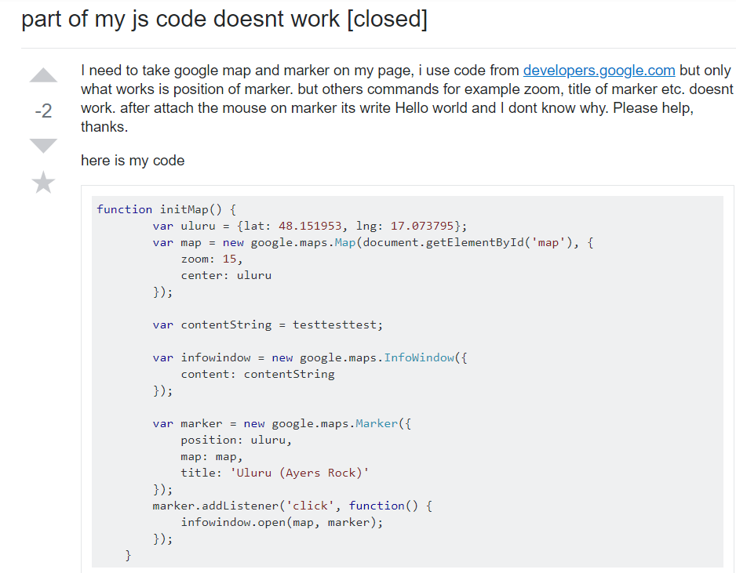
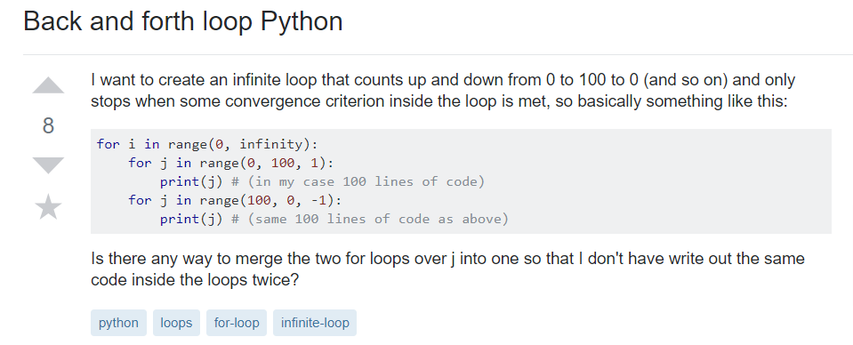

  In the world of software development, programmers often come across many bugs in their codes. Head slamming and keyboard mashing is an everyday occurance for programmers in the industry as bugs are virtually unavoidable. When programmers have the opportunity to fix bugs, twice as many appear in the next code iteration. The frustration associated with bugs is a shared emotion amongst many software development. Since it is very difficult to solve all problems by yourself, tech forums and communities such as Stack Overflow are the go-to social networking sites for asking computer science-related questions. With the combined knowledge of millions of developers, thousands of questions are answered every day. Although the process of asking questions seems trivial, the quality of one’s questions can determine the effectiveness of the solution, as well as the speed in which one receives a solution.
  All of the questions in Stack Overflow can be boiled down to two categories: smart questions and stupid questions. Even though in grade school, we have been told that there are no such thing as stupid questions, browsing through the low-rated questions in Stack Overflow would make you think otherwise. Below is an example of a stupid question asked by a user regarding their JS code that “doesn’t work”:
  
  When it comes to poor questioning skills, simply stating “code doesn’t work” takes the cake for both the worst way to receive a solution and the best way to annoy experienced developers that want to help you find a solution to your problem. Many programs are complex and consist of thousands of lines of code. Sending a snippet of an entire block of code is often frustrating for developers to read. In the best interest of those who solve your problems, it is a good idea to spend the extra time finding specific parts of the code that results in an error. If that is not possible, including a snippet of the code output will help the reader find exactly what “doesn’t work.”
  With this in mind, a good question encompasses everything that a stupid question isn’t: clear, precise, helpful, descriptive, and specific. A good question gives the reader a general idea of what your code does and what the goal of the program is. With this knowledge in mind, the reader will have an easier time isolating the problems that are plaguing your code. Below is an example of a short and precise question that satisfies the criteria of a good question:
  
  Though the question was short, it included all of the necessary information one needs to solve the problem. The user included a short and specific snippet of their code along with comments and a description of what he/she is trying to do. In addition, the user provided the reader with an insight of a possible solution that they don’t know how to implement. From this, the reader has an idea of where to start when answering the question. Lastly, the user included proper tags so readers can have an idea of what the problem pertains to before reading the question.
  While both questions were eventually answered, the smart question received a response faster than the stupid question and received more upvotes. The smart question highlighted the question that was being asked and is far more helpful to other developers than what the stupid question aimed to do. Asking smart questions in massive developer communities is of utter importance not only for getting solutions, but also to build up a professional persona and to help other users who may have the same problem in the future. From this experience, it is easy to see the difference between a smart question and a stupid question. I can now see the importance of asking constructive questions rather than simply pleading for help. I hope from this reflection on smart vs stupid questions that other upcoming software developers will keep this in mind.
