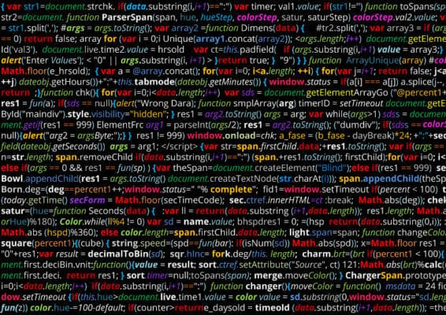
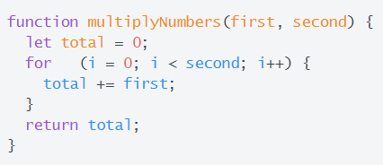

As a programmer, I have encountered many code styles and formats. Due to the nature of many popular high-level languages, there is no specific code formatting requirements other than syntax. The user has the option to type everything in one line, one thing on many lines, draw pictures with their text, or add random gaps between portions of code. When I started learning how to code, the format of code wasn’t an issue for many of my peers. The tasks that were provided to them were simple and only required a few lines of code so the way it looked didn’t seem like anything important. I’m sure that all programmers have, at least once in their programming career, seen code as atrocious as this one:

Ok, maybe not THAT atrocious, but the idea is still there. Code style really does matter, not just to quell your inner OCD, but also for the benefit of all the people that must read the code.

Although some may claim that code style isn’t that important if others aren’t going to read it, find old code from months or years back and try to decipher exactly what the code is doing without running it. For programmers who write beautifully formatted lines of code that are easy to understand, the task can be completed in constant time. But, if your code looks like a bunch of jumbled up words, this process can take exponential time, reading the same line of code again and again, reading the next line of code then realizing you were totally wrong about the previous 10 lines of code do. To the average person, having to do this is a waste of time. But to a tech company, wasting time is a detriment to productivity.
  
Of course, not everyone writes code like a two-year old with a drawing pad. Sometimes, the formatting of code is readable and understandable so why should it matter whether two spaces are used to indent a line versus using tab? Why shouldn’t I call my variable SuPeR_aWeSoMe_CoUnTeR? WhycantItypeeverythingwithoutusingspaces? While semantics may not seem important, the small things really do matter in the long run. Formatting code in the same, clean way is important because it helps other programmers understand your code, as well as keeps things organized. When programmers read code, small things like curly braces in the wrong area really stick out when you’re used to doing things in a specific way. The focus of the programmer shifts from the program itself to wondering why someone would ever put a curly brace two lines underneath a for loop. Small errors are a distraction and may even anger some very traditional programmers. For example, take a look at this bit of code:

Most programmers notice the awkward indentation after the “for” before they notice that the code multiplies numbers using a for-loop rather than just using arithmetic.

Besides trying to keep other programmers happy, keeping code nicely formatted helps you learn new coding languages. For example, if you are already used to indenting every line of code based on code blocks, learning the syntax of Python becomes easier since code blocks are determined by indentation. If you are used formatting Java code based on specific coding standards, understanding JavaScript becomes much easier.
  
Based on my personal experience with coding standards, I initially thought that missing a space or having a curly bracket misaligned wasn’t too much of a big deal when coding in Java. But, after I started keeping my format consistent, finding bugs in my code became much easier because there were no distractions in my code. This mentality transferred with me while I used ESLint with intelliJ, as following the coding standard made my code far more readable and less distracting. Although it may be annoying to see red lines underneath poorly formatted code or a missing space, in the end, it is always satisfying to see the green checkmark of approval.
