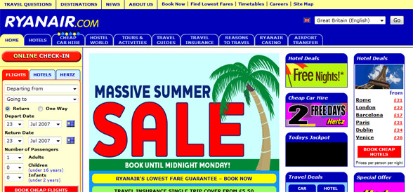
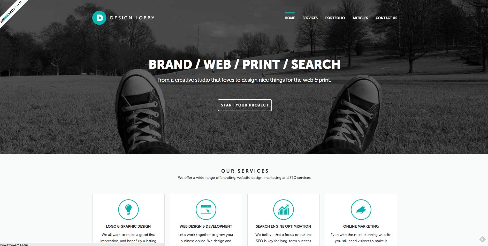
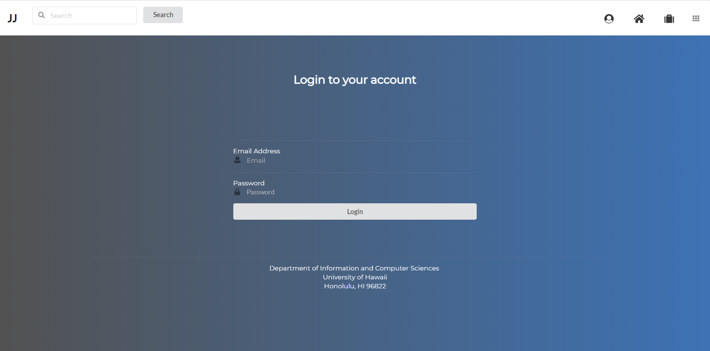

  While designing web application, there are two important factors that I always keep in mind: functionality and aesthetic design. In my opinion, successful design patterns must encompass both functionality and looks. A web application that is designed for function without incorporating aesthetics are visually unappealing and typically drives user away from your site. A web application that is designed with aesthetics without function is an empty shell that has no purpose for users. Although design is subjective, there are a few patterns that I try to follow whenever I design a web application.
	
  When I design the functionality of a site, I often try to encompass both ease of use and distinct purpose. I’m sure we have all seen a website that is extremely crowded and convoluted. Here is a clear example of a site whose purpose is clearly unclear:

 
  If a user were to access this site, they would immediately be lost. The combination of obnoxious placement of elements along with the excessive tabs makes this site immediately unattractive to most users. From looking at the landing page for a while, one can eventually tell that the website has to do with travel, but the goal of the website is all over the place. In my opinion, the owner of this website took the idea of “all-in-one” a bit too far.

  A good example of website functionality and design that I found is coincidentally a website meant to help users design web applications:
  

   
  The landing page for this website demonstrates a clean layout that is easy for users to navigate, provides a sense of location when navigating the page since it is immediately clear that the user is on the home page, and demonstrates a clear purpose. When a user accesses this site, they will have no problem figuring out how to start a project and navigate the website since it is all laid out in front of them. In addition, a user can immediate know if the website provides the services they want because information about the site is presented clearly on the landing page.

  Everytime I work on front-end development, I try to imitate the general design aspects of these sites. I believe that it is important to always question why something is appealing and what makes it appealing. Design patterns are important not only for attracting users, but also providing users with a sense of belonging. If a website is well designed, users are more likely to continue using the site. 
In practice, I always try to make everything in my websites accessible within two clicks. Many people who browse websites want to find what they need as fast as possible. Forcing a user to search through many things manually is a great way to rapidly decrease site traffic. From my experience, two clicks is the maximum I am willing to go until I feel like the site has way too many tabs and not enough shortcuts.

  Another important aspect of web design that I like to keep in mind is consistency. If a navbar or side menu is constantly moving around or the layout each page is dramatically different than the others, it is easy to get lost in the transforming mess. In addition, a website with far too many different colors is an annoyance to the eye and can cause unnecessary headaches. While designing websites, I try to keep certain components static on each page so the user knows for sure that they can go back to that part of the page. I also try to use a maximum of 3 different colors that complement each other on page. Any more and the website would have too many. In my Jiffy Jobs web application, I specifically used a color gradient as the background to create an appealing yet simple design.
  
  Often times, I like to follow a consistent pattern of minimalistic aesthetic design. The less elements there are to look at, the more open and breathable the site becomes. Sometimes, I like to think of a page as a desk and each component of the page are items that you put on the desk. If you put too many things on the desk, it will look messy and it will be hard to find things but if you put only a few things on the desk, there is a lot more open room. An example of minimalistic design in practice is my login page for the Jiffy Jobs web application:
  

   
  When designing the page, I specifically made the conscious decision to eliminate text boxes as they seemed a bit too clunky and instead opted for dividers to represent each field section. I also decided to center the elements to make the user focus on the few elements and direct them accordingly.
  
  I could go on and on about different aspect of web design that I like to keep in mind, but the most important takeaway is that website should be designed with a clear focus in mind and a well made design that users are able to appreciate. Although the idea of minimalistic web design doesn’t appeal to all user, I believe that it is important to keep websites clean and simple. Users are not given instruction manuals for navigating websites, therefore I find it important to guide the user through the site without overwhelming them. Even something as simple as color can be enough to lead the user in the right direction. Art design is ever-evolving and so should web design. Designs that are seen as modern now may be ancient in a few years therefore it is also important to follow “modern” design trends as they evolve over time.
