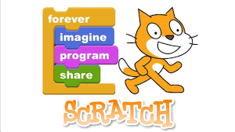

When I decided to pursue the field of computer science and later cyber security, I started learning how to code with a very basic language used to teach people the basics of programming: Scratch. From my experience with Scratch, I started to look at programming in a global scope. I realized that there are far more applications that simple logic-based blocks have then I initially imagined. After creating very simple programs, I started to learn Python.

My first exposure to Python left me confused and later, intrigued. Since I started coding with simple blocks, the exposure to text based code was intimidating at first. After taking a class in high school from a very inspirational teacher, I quickly caught on to the simplicity and ease of use that Python provided users. From that experience, I started to write simple Python programs that made my high school experience easier such as homework planners and advanced calculators.

The first required ICS class at UH Manoa, ICS 111, was my first exposure to the Java programming language. Since I already knew how to code in python, learning the basics of Java was a simple task. With a few changes in syntax and the introduction of curly braces and semi-colons, I caught on the Java fairly quickly. But, once I started to learn more Java, I realized that everything in Java is an object, a concept that I only learned very breifly in my Python course. After a lot of practice, I started to understand the concepts of data structures which I then implemented in Java.

ICS 314, software engineering, was my first exposure to JavaScript. Before the class, I've heard a lot about how useful JavaScript is and how Java is to JavaScript as car is to carpet, but I haven't attempted to try it. Though the freecodecamp.org JavaScript crash course, I realized that JavaScript is similar to both Python and Java in terms of syntax. The ease of use that the JavaScript language provides made me realize why it is so widely used by software engineers. The universal support for JavaScript as well as its functionality made my first experience with JavaScript a pleasant one.

The first week of the ICS 314 course was also my first exposure to the "athletic programming" pedagogy. Though at first, the idea of timed programming assignments were intimidating, by practicing workouts of the day (WODs) at home until I could complete them in a reasonable time, I found the first actual WOD less intimidating than I initally thought. I believe that this style of learning is overall more beneficial than standard lecturing because WODs are far more engaging and they require students to practice programming whereas lecturing in typically unengaging. Though it is just the beginning of the year, I believe that this style of learning will help me further improve my programming skills better than other learning strategies.
