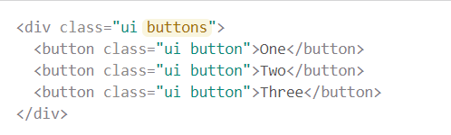

UI frameworks, though intimidating at first, provides a much needed basis for creating visually appealing web applications. Through my experience with HTML/CSS, it was easy to notice the visual nightmare that raw HTML/CSS code creates. To fix the visual issue, software engineers are forced to spend hours attempting to fix alignment pixel-by-pixel, adding elements and changing their properties to put them in the right places, and having to deal with extremely basic default formatting. To put it simply, raw HTML/CSS is not useful if your goal is to attract people to your site. Unless you are willing to spend countless days or even weeks designing a semi-attractive site, the clear solution is to have something do the difficult backend work for you.

The option of importing a bunch of premade classes that handles the difficult formatting and design is great for software engineers that are focused on making attractive sites in a reasonable amount of time. Since UI frameworks such as Semantic UI come pre-built with many formatting classes and customization options, completing formatting tasks that would typically take hours to complete with raw HTML/CSS can be completed by adding the class to an HTML division. For example, creating margins for different sections in HTML can be frustrating since the padding of each section must be adjusted manually, which can take some time. Semantic UI provides the “container” class that pads the division for you, reducing the amount of time to complete the task significantly.

In addition to fixing margins, UI frameworks like Semantic UI allows web designers to implement standard design features that appear in many popular websites with ease. Although there is no simple formula for attractive design, frameworks provide a very good starting point to create attractive sites. In Semantic UI, for example, it is extremely easy to implement dropdown menus which would normally be very complex task to complete with raw HTML and CSS. Dropdown menus appear commonly in many sites, therefore having the option to simply use a class is beneficial to software engineers.

Now that we have established the benefit of using a UI framework, the burning question is which framework should I use? From my experience with Semantic UI, I can highly recommend it because of its ease of use and its similarity to the English language. A great example that highlights the benefits of Semantic UI is creating a grid. If we wanted to specify a grid with exactly four columns, we could simply type “ui four column grid container” as the class name. Simply put, Semantic UI follows normal english conventions with descriptive words before the noun.

To create groups of thing such as buttons, Semantic UI follows English plurality conventions. For example, a group of buttons can be created with the class “ui buttons” with each individual button defined in the division.

In my opinion, the most difficult thing about UI frameworks like Semantic UI is getting started. Since each framework contains many classes that each follow their own conventions, learning a UI framework is like learning an entirely different language. Documentation of frameworks can be long and confusing at first considering the amount of resources. In addition, trying to resolve issues by browsing tech forums can be more difficult than trying to resolve issues with raw HTML/CSS since there the behavior of classes differ from framework to framework. One would have to find a user who encountered the same issue while using the exact same framework or a developer of the framework to fix framework-related issues.

Although learning how to use and implement a UI framework can be difficult, the benefits of using a framework far outweighs the cost of learning how to use it. While watching videos and reading documentation on a framework may take hours, trying to implement design on your own can take days or even weeks depending on the task. The amount of time and headaches saved from using UI frameworks should entice all software engineers to implement one when creating web applications.
