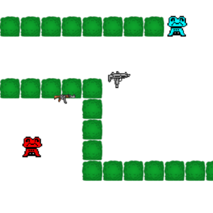

 
As a final project for my ICS 111 class, my group and I created a simple two-player shooter game in Java. The objective of the game is to lower your opponent's health to 0 by picking up weapons around the map and shooting your opponent. This simple game uses a single keyboard to control each character, allowing both players to play on one computer at the same time.

During the development of the game, I primarily worked on the bullet physics, player controls, weapon controls/spawning, and the main user interface. Most of the development was done in the span of a few weeks and the graphics were created using the EZGraphics Java library provided to us. 

Through this project, I gained experience in group development and creating larger projects in a timely manner. I also improved my Java coding skills by working on this project.

You can view a short gameplay video here: (https://www.youtube.com/watch?v=-kvfI1Ywa0I).

