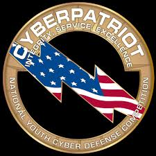

Cyber Patriot is a national cyber security competition where students are given a compromised computer image and must compete in teams to secure the image in a set amount of time. The image that I primarily worked on during the competition was the Ubuntu OS.

At Mililani High School, the Cyber Patriot club consisted of multiple teams that competed with each other and other schools in Hawaii. As second-in-command of my group and the primary Ubuntu specialist, our team managed to place second in the state.

Through Cyber Patriot, I developed an interest in cyber security as well as developed my cyber security skills. I was able to learn how to use and work with the Ubuntu operating systems as well as other similar Linux-based operating systems. Cyber Patriot also helped me develop leadership skills as I trained newcomers to the team and taught them the basics of Ubuntu security in the few training weeks before the competition season.
 
Cyber Patriot website: https://www.uscyberpatriot.org/
